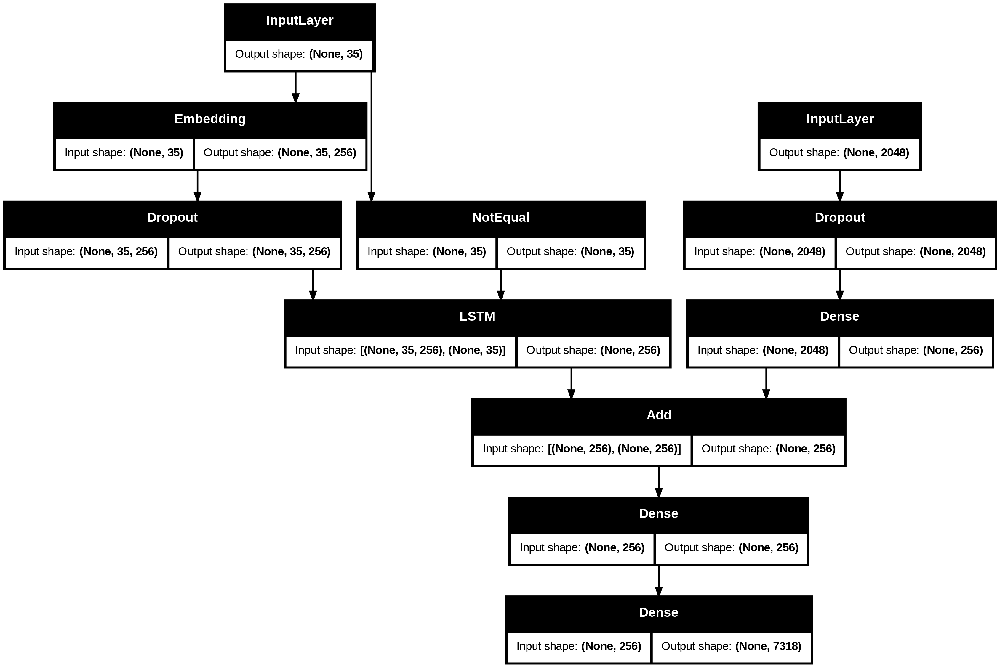

# Image Caption Generator

This project uses a deep learning model to automatically generate captions for images. It leverages a Convolutional Neural Network (CNN) to extract features from images and a Recurrent Neural Network (RNN) with LSTM cells to generate descriptive text sequences.



## Features
- **CNN for Feature Extraction:** Uses the pre-trained Xception model to extract rich features from images.
- **LSTM for Caption Generation:** A Long Short-Term Memory (LSTM) network generates captions word by word based on the image features.
- **Modular Design:** The code is structured for training, testing, and feature extraction.

## Technology Stack
- Python
- TensorFlow & Keras
- NumPy
- Matplotlib & Pillow

## Setup and Installation

1.  **Clone the repository:**
    ```bash
    git clone https://github.com/STARRSOUL/Image-caption-generator.git
    cd Image-caption-generator
    ```

2.  **Create and activate a virtual environment (recommended):**
    ```bash
    # For Windows
    python -m venv venv
    .\venv\Scripts\activate

    # For macOS/Linux
    python3 -m venv venv
    source venv/bin/activate
    ```

3.  **Install the required dependencies:**
    ```bash
    pip install -r requirements.txt
    ```

## Project Data

Due to their large size, the dataset, pre-trained model weights, and other generated files are not stored in this Git repository.

  **Dataset (Flickr8k):**
    - You need to download the Flickr8k dataset, which contains the images and their corresponding text descriptions.
    - **Download Link:** [**https://drive.google.com/file/d/1u3oqx36XApnAykFDB6EEWUIfd_CxRQQ9/view**](https://www.kaggle.com/datasets/adityajn105/flickr8k)

    - **Download Link:** [**https://drive.google.com/file/d/1qcRy3WpQv4dGtu65gETtYLWxDPBrRtx1/view**](https://www.kaggle.com/datasets/adityajn105/flickr8k)

    - After downloading, place the images in the `Image_Dataset/` directory and the text files (like `Flickr8k.token.txt`) in the `Dataset_text/` directory.


## Usage

To generate a caption for an image, run the `test.py` script with the path to your image.

```bash
python test.py --image "path/to/your/image.jpg"
```

For example:
```bash
python test.py --image "Image_Dataset/1000268201_693b08cb0e.jpg"
```

The script will output the generated caption and display the image.

## Training

To train the model from scratch, you will need to run the `main.py` script. This script will:
1.  Pre-process the text data.
2.  Extract features from all images using the Xception model and save them to `features.p`.
3.  Create and save the tokenizer to `tokenizer.p`.
4.  Train the captioning model and save the weights in the `models2/` directory.

*Note: Training is a computationally intensive process and may take a significant amount of time.*
 
